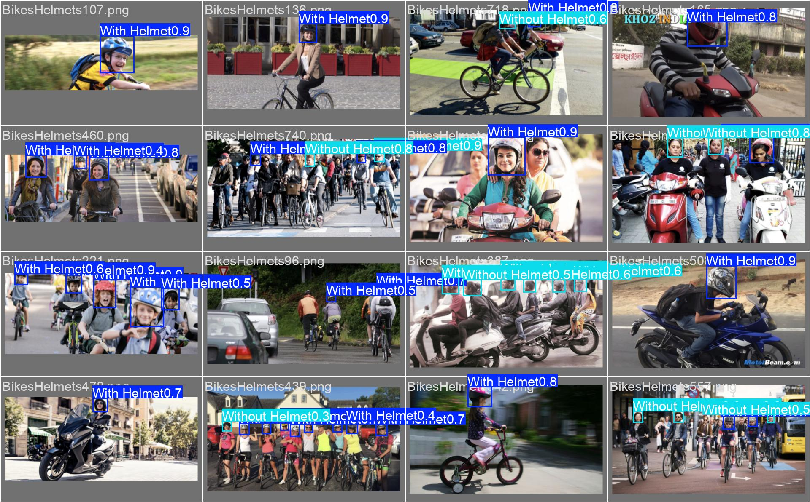
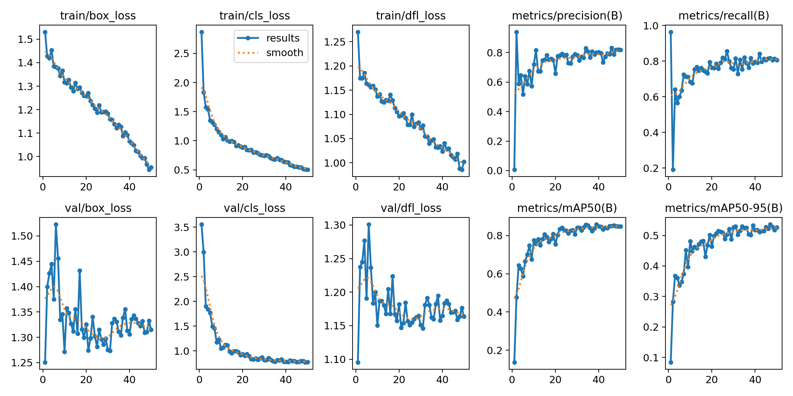
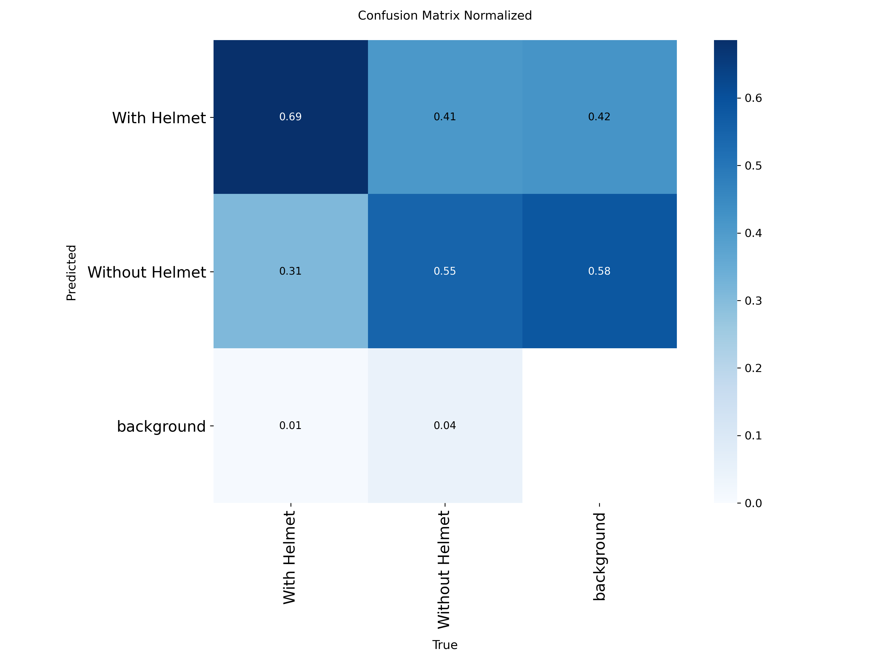

# 🪖 Helmet Detection for Two-Wheeler Riders


A real-time deep learning system that detects motorcycle riders **with** and **without** helmets
from a webcam, image or video, and automatically saves snapshots of violations as evidence.

Built as a Deep Learning mini project using **YOLOv8**, **OpenCV** and **Streamlit**.

---

## 📌 Problem Statement

Two-wheeler accidents cause a large share of road deaths in India, and many of these riders
are not wearing helmets. Checking every rider manually is impossible for traffic police.
This project automates helmet-rule monitoring using computer vision, so cameras can flag
violations on their own.

## ✨ Features

- 🎥 **Real-time detection** from a webcam or video file
- 🟩🟥 **Colour-coded boxes**: green for helmet, red for no helmet
- 📸 **Automatic evidence capture**: saves a snapshot whenever a violation is detected
- 📊 **Live counters**: FPS, riders with helmet, riders without helmet
- 🌐 **Web app** (Streamlit) for image, camera and video detection
- ⚡ **Lightweight**: YOLOv8-nano runs in real time on a normal laptop CPU

## 🖼️ Demo

Sample predictions on the validation set:



## 🧠 How It Works

```
Camera / Image / Video
         │
         ▼
   OpenCV reads frame
         │
         ▼
   YOLOv8n detector  ──►  bounding boxes + class + confidence
         │
         ▼
   Helmet / No-helmet logic
         │
   ┌─────┴──────────────┐
   ▼                    ▼
Draw boxes &       Save snapshot
show counts        if violation
```

1. **Model:** YOLOv8n (nano), a one-stage object detector that predicts boxes and classes
   in a single pass, which makes it fast enough for real-time video.
2. **Transfer learning:** training starts from weights pretrained on the COCO dataset,
   then the model is fine-tuned on helmet images, so it learns well from a small dataset.
3. **Post-processing:** Non-Maximum Suppression (NMS) removes duplicate overlapping boxes,
   and a confidence threshold filters weak detections.

## 📂 Dataset

- **Source:** [Helmet Detection, Kaggle (andrewmvd)](https://www.kaggle.com/datasets/andrewmvd/helmet-detection)
- **Size:** about 760 images
- **Classes:** `With Helmet`, `Without Helmet`
- **Format:** Pascal VOC XML, converted to YOLO format by `setup_and_train.py`
- **Split:** 80% training, 20% validation

## 📈 Results

| Metric | Value |
|---|---|
| Precision | _add value_ |
| Recall | _add value_ |
| mAP@0.5 | _add value_ |
| mAP@0.5:0.95 | _add value_ |

<sub>Values come from the last row of `runs/detect/runs/helmet/results.csv`.</sub>

**Training curves** (loss, precision, recall, mAP over epochs):



**Confusion matrix:**



## 🗂️ Project Structure

```
helmet-detection/
├── app.py                 # Streamlit web app (image / camera / video)
├── detect_webcam.py       # Real-time webcam / video detection
├── helmet_utils.py        # Drawing boxes + violation logic
├── setup_and_train.py     # Dataset download, VOC→YOLO conversion, training
├── models/
│   └── helmet_best.pt     # Trained YOLOv8n weights
├── runs/                  # Training graphs and sample predictions
├── requirements.txt
└── README.md
```

## 🚀 Getting Started

### 1. Clone the repository

```bash
git clone https://github.com/katkarvismaya19-web/HelmetDetection-DL.git
cd HelmetDetection-DL
```

### 2. Create a virtual environment and install dependencies

**Windows**
```bash
python -m venv .venv
.venv\Scripts\activate
pip install -r requirements.txt
```

**macOS / Linux**
```bash
python3 -m venv .venv
source .venv/bin/activate
pip install -r requirements.txt
```

### 3. Run

**Real-time webcam detection**
```bash
python detect_webcam.py
```

**Save snapshots of violations** (stored in `violations/`)
```bash
python detect_webcam.py --save-violations
```

**Run on a video file**
```bash
python detect_webcam.py --source path/to/video.mp4
```

**Web app**
```bash
streamlit run app.py
```
Then open http://localhost:8501 in your browser.

Press **Q** to close the webcam window.

### Command-line options

| Option | Default | Description |
|---|---|---|
| `--weights` | `models/helmet_best.pt` | Path to trained model |
| `--source` | `0` | Webcam index or video file path |
| `--conf` | `0.4` | Confidence threshold (0–1) |
| `--save-violations` | off | Save frames with riders without helmets |

## 🏋️ Training Your Own Model

Training needs a GPU, so Google Colab (free T4 GPU) is recommended.

1. Get your Kaggle API key: Kaggle → Settings → API → Create New Token (`kaggle.json`).
2. In Colab, set **Runtime → Change runtime type → T4 GPU**.
3. Upload the project files and `kaggle.json`, then run:

```bash
pip install ultralytics kaggle
python setup_and_train.py
```

The trained model is saved to `models/helmet_best.pt`.
To train for longer: `EPOCHS=80 python setup_and_train.py`

## 🛠️ Tech Stack

| Component | Technology |
|---|---|
| Language | Python |
| Detection model | YOLOv8n (Ultralytics) |
| Deep learning framework | PyTorch |
| Video processing | OpenCV |
| Web interface | Streamlit |
| Training environment | Google Colab (T4 GPU) |

## ⚠️ Limitations

- Accuracy drops in low light, rain or at night, since most training images are daytime.
- Riders far from the camera or partly hidden by other vehicles may be missed.
- Caps, scarves or hoods can sometimes be confused with helmets.

## 🔮 Future Scope

- 🔢 Integrate **Automatic Number Plate Recognition (ANPR)** to identify violators' vehicles
- 🧾 Auto-generate **e-challans** with timestamp and snapshot evidence
- 👥 Detect **triple riding** and pillion riders without helmets
- 🌙 Train on night-time and bad-weather images
- 📱 Deploy on edge devices such as Raspberry Pi or Jetson Nano at traffic signals

## 👩‍💻 Author

**Vismaya Katkar**
GitHub: [@katkarvismaya19-web](https://github.com/katkarvismaya19-web)

## 🙏 Acknowledgements

- [Ultralytics YOLOv8](https://github.com/ultralytics/ultralytics)
- [Helmet Detection dataset](https://www.kaggle.com/datasets/andrewmvd/helmet-detection) by andrewmvd on Kaggle

---

⭐ If you found this project useful, consider giving it a star!
